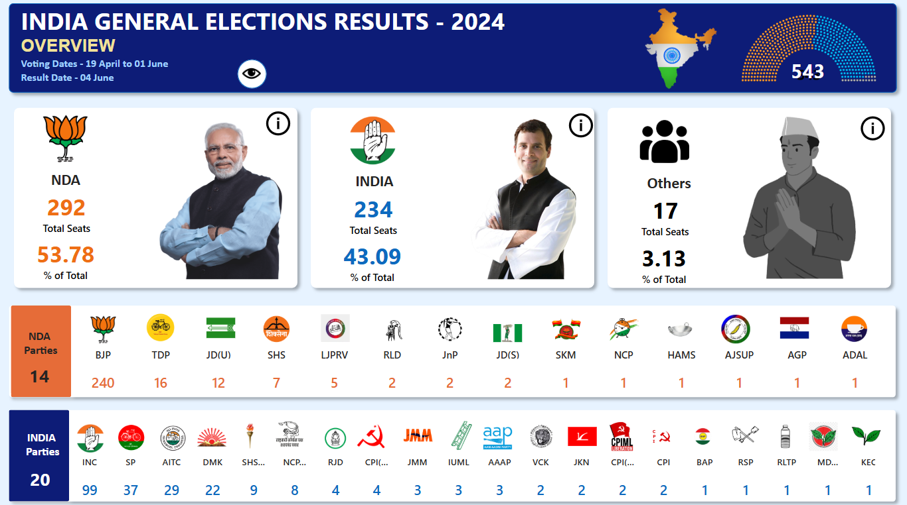
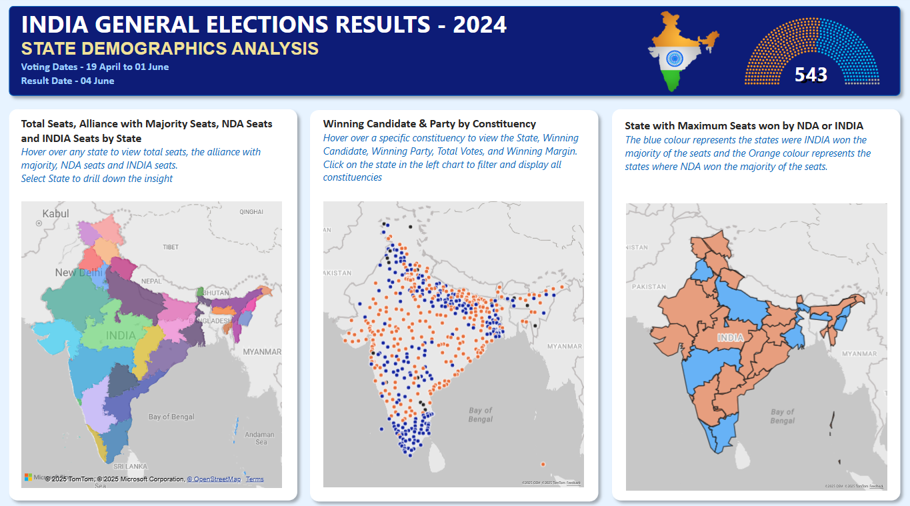
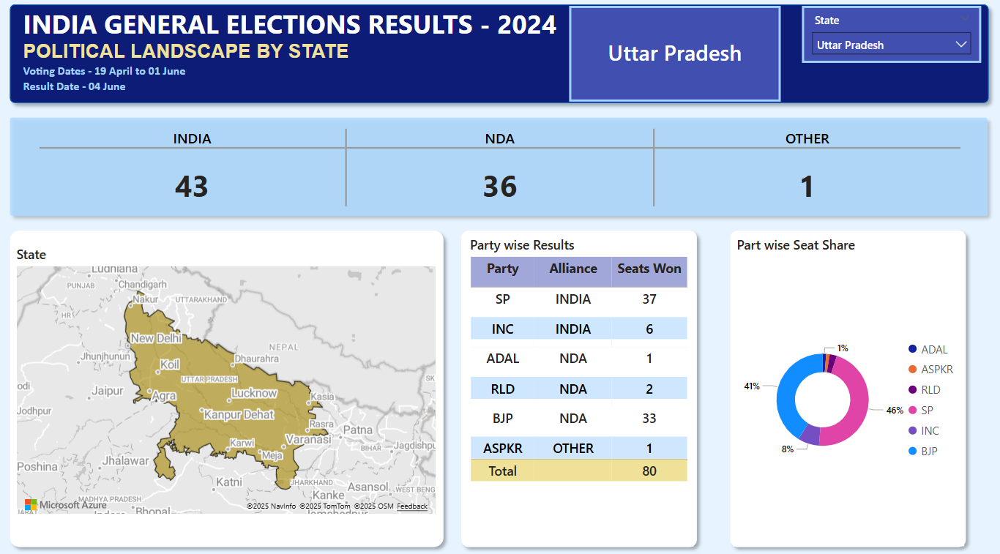
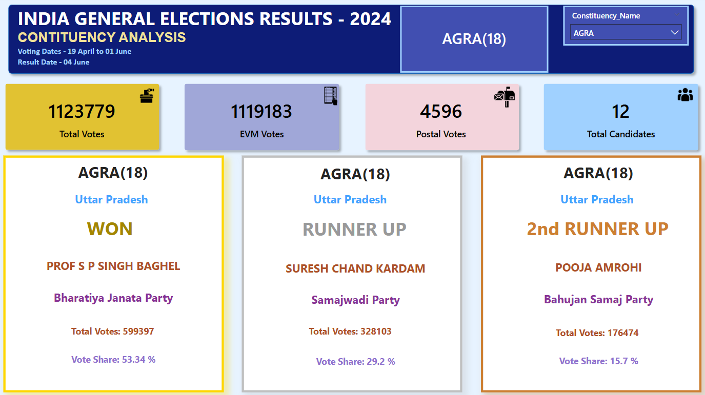
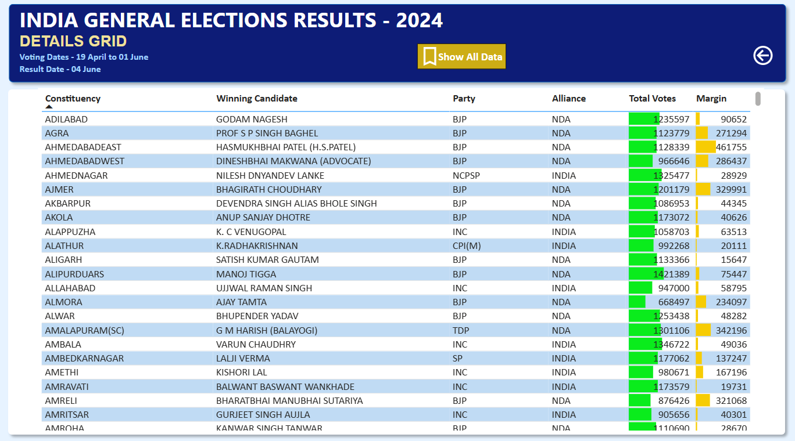
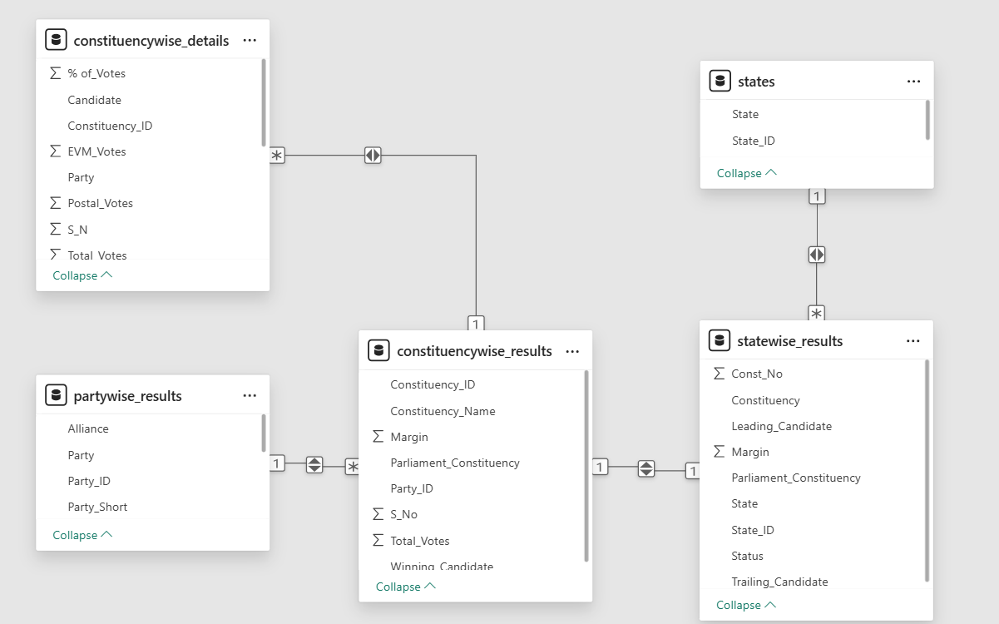

# India General Election Results Dashboard – 2024

This project presents an interactive Power BI dashboard suite analyzing the results of the 2024 Indian General Elections. It provides a detailed overview of party and alliance performance, state-wise demographics, and constituency-level outcomes. The goal is to support political analysis, public transparency, and data-driven insight.

**Author:** Sarim Rizvi
**Tools Used:** Power BI, DAX, Bookmarks, Drill-through, Visual Interactions

---

## Dashboards Overview

### 1. Overview Analysis
- Seat distribution for:
  - NDA
  - INDIA
  - Independent & Other Parties
- KPIs:
  - Total seats won
  - Vote share Percentage
  - Party-wise seat distribution with logos
- Detailed grid tables via bookmarks

### 2. State Demographic Analysis
- State-wise breakdown of:
  - Total seats
  - Majority-winning alliance
  - NDA and INDIA seats
- Map visualization with tooltips and drill-through

### 3. Political Landscape by State
- Dynamic state filter
- Metrics for selected state:
  - Seats by NDA, INDIA, and Others
  - Party-wise results (grid and donut chart)

### 4. Constituency Analysis
- In-depth results per constituency:
  - Total votes, EVM votes, postal votes
  - Top 3 candidates with vote share
- Bubble map visualization by party/alliance

### 5. Details Grid
- Master data table including:
  - Constituency, candidates, party, vote details, and margin
- Functionalities:
  - Drill-through support
  - Export to Excel
  - Bookmark to reset filters and show all data

### 6. Landing Page
- Central navigation hub
- Clean, responsive layout
- Buttons to access all dashboards
- Consistent home button for easy navigation

---

## Dashboard Previews

### 1. Overview 



### 2. State Demographics Analysis



### 3. Political Landscape by State



### 4. Constituency Analysis



### 5. Details Grid



## Data Model

The data model was designed to support robust filtering and interactivity in Power BI.

### Key Entities:
- Constituency (with ID and number)
- Party and alliance mapping
- State and region-level grouping
- Candidate and vote records

### Key Relationships:
- One-to-many links between state and constituencies
- Party-affiliation joins with vote results
- Drill-through and cross-filtering across entities

 

---

##  Features

-  Bookmark-driven navigation  
-  Drill-through to constituency/state details  
-  Exportable data grid  
-  Interactive tooltip and map visualizations  
-  Donut charts, bubble maps, and filters  
-  Party logo integration and visual consistency

---

##  Repository Structure

```
/data                       → Raw & processed data (optional)
/visuals                    → Dashboard screenshots & diagrams
/scripts                    → SQL queries
India_Elections_2024.pbix   → Power BI dashboard file
README.md                   → Project overview and usage guide
```

---

##  How to Use

1. Download and open `India_Elections_2024.pbix` in Power BI Desktop.
2. Start with the **Overview** and navigate to each dashboard.
3. Use filters, tooltips, and drill-through features to explore data.
4. Export any detailed view using the export options in the **Details Grid**.

---
